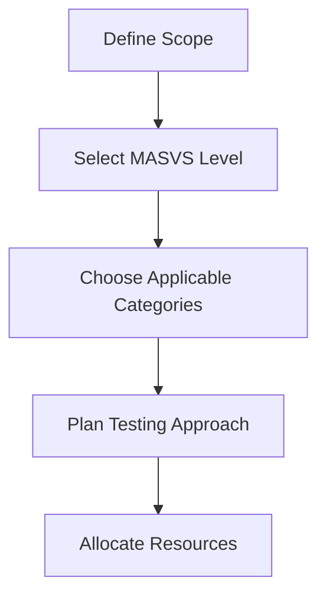

# OWASP MASVS Overview

## Introduction to OWASP MASVS

The **OWASP Mobile Application Security Verification Standard (MASVS)** is a comprehensive framework that establishes the foundation for mobile application security testing and secure development. It provides a systematic approach to mobile security by defining security requirements that mobile applications should implement.

## Core Principles

### 1. Verification-Based Approach
MASVS focuses on **what to verify** rather than **how to test**, making it:
- Platform-agnostic (covers both Android and iOS)
- Tool-agnostic (applicable regardless of testing tools used)
- Methodology-flexible (adaptable to different testing approaches)

### 2. Risk-Based Classification
The standard provides three verification levels:

| Level | Description | Use Case |
|-------|-------------|----------|
| **L1** | Standard Security | Basic security requirements for most mobile apps |
| **L2** | Defense-in-Depth | Enhanced security for apps handling sensitive data |
| **L3** | Advanced Security | Maximum security for high-risk applications |

## MASVS Categories Deep Dive

### MASVS-STORAGE: Data Storage and Privacy

**Objective**: Ensure sensitive data is stored securely on the device and proper data handling practices are followed.

#### Key Requirements:
- **Secure Local Storage**: Sensitive data encrypted when stored locally
- **System Credential Storage**: Use secure system-provided storage mechanisms
- **Data Minimization**: Only necessary data is stored locally
- **Data Retention**: Proper data lifecycle management

#### Common Vulnerabilities:
- Unencrypted sensitive data in shared storage
- Hardcoded credentials in application files
- Inadequate data sanitization
- Insecure backup storage

#### Assessment Focus:
```
✓ Database encryption implementation
✓ SharedPreferences/NSUserDefaults security
✓ File system permissions and encryption
✓ Keychain/Keystore usage validation
✓ Backup data protection
✓ Application logs data exposure
```

### MASVS-CRYPTO: Cryptography

**Objective**: Ensure cryptographic controls are implemented correctly and follow industry best practices.

#### Key Requirements:
- **Strong Cryptographic Standards**: Use proven cryptographic algorithms
- **Proper Key Management**: Secure key generation, storage, and rotation
- **Random Number Generation**: Use cryptographically secure random sources
- **Certificate Validation**: Proper SSL/TLS implementation

#### Common Vulnerabilities:
- Weak or deprecated cryptographic algorithms
- Poor key management practices
- Insufficient randomness in security-critical operations
- Improper certificate pinning implementation

#### Assessment Focus:
```
✓ Cryptographic algorithm strength
✓ Key derivation and storage mechanisms
✓ Random number generator security
✓ SSL/TLS configuration validation
✓ Certificate pinning implementation
✓ Encryption key lifecycle management
```

### MASVS-AUTH: Authentication and Authorization

**Objective**: Verify proper implementation of authentication and authorization mechanisms.

#### Key Requirements:
- **Multi-Factor Authentication**: Strong authentication mechanisms
- **Session Management**: Secure session handling
- **Authorization Controls**: Proper access control implementation
- **Biometric Authentication**: Secure biometric implementation

#### Common Vulnerabilities:
- Weak password policies
- Inadequate session management
- Broken authentication flows
- Privilege escalation vulnerabilities

#### Assessment Focus:
```
✓ Authentication mechanism strength
✓ Session token security
✓ Authorization bypass testing
✓ Biometric authentication security
✓ Password reset flow security
✓ Account lockout mechanisms
```

### MASVS-NETWORK: Network Communication

**Objective**: Ensure secure network communication and proper implementation of network security controls.

#### Key Requirements:
- **TLS Implementation**: Proper TLS configuration
- **Certificate Validation**: Strong certificate validation
- **Network Security**: Protection against network-based attacks
- **Data in Transit**: Encryption of sensitive data transmission

#### Common Vulnerabilities:
- Insecure network protocols
- Poor certificate validation
- Man-in-the-middle attack vulnerabilities
- Unencrypted sensitive data transmission

#### Assessment Focus:
```
✓ TLS/SSL configuration strength
✓ Certificate pinning validation
✓ Network protocol security
✓ API endpoint security
✓ Data transmission encryption
✓ Network traffic analysis
```

### MASVS-PLATFORM: Platform Interaction

**Objective**: Ensure secure interaction with mobile platform features and proper handling of platform-specific security mechanisms.

#### Key Requirements:
- **IPC Security**: Secure inter-process communication
- **Platform Permissions**: Proper permission handling
- **WebView Security**: Secure WebView implementation
- **Deep Link Security**: Secure URL scheme handling

#### Common Vulnerabilities:
- Intent hijacking attacks
- Insecure IPC mechanisms
- WebView vulnerabilities
- Deep link manipulation

#### Assessment Focus:
```
✓ Intent filter security (Android)
✓ URL scheme handling (iOS)
✓ WebView configuration security
✓ Permission model implementation
✓ IPC mechanism security
✓ Platform API usage validation
```

### MASVS-CODE: Code Quality and Build Settings

**Objective**: Ensure high code quality and proper build configuration for security.

#### Key Requirements:
- **Code Quality**: Secure coding practices
- **Build Security**: Secure build process
- **Third-party Libraries**: Secure dependency management
- **Error Handling**: Proper error handling implementation

#### Common Vulnerabilities:
- Code injection vulnerabilities
- Insecure build configurations
- Vulnerable third-party dependencies
- Information disclosure through error messages

#### Assessment Focus:
```
✓ Code injection vulnerability testing
✓ Build configuration security
✓ Dependency vulnerability scanning
✓ Error handling security
✓ Code obfuscation implementation
✓ Debug information exposure
```

### MASVS-RESILIENCE: Anti-Tampering and Anti-Reversing

**Objective**: Implement controls to detect and respond to tampering and reverse engineering attempts.

#### Key Requirements:
- **Anti-Debugging**: Detection of debugging attempts
- **Anti-Tampering**: Detection of application modification
- **Runtime Integrity**: Runtime application protection
- **Reverse Engineering Protection**: Code obfuscation and protection

#### Common Vulnerabilities:
- Insufficient runtime protection
- Weak obfuscation techniques
- Inadequate tampering detection
- Poor response to security events

#### Assessment Focus:
```
✓ Runtime tampering detection
✓ Debugging detection mechanisms
✓ Code obfuscation effectiveness
✓ Anti-reversing control testing
✓ Integrity verification mechanisms
✓ Response to security events
```

### MASVS-PRIVACY: Privacy Controls

**Objective**: Ensure proper implementation of privacy controls and data protection mechanisms.

#### Key Requirements:
- **Data Minimization**: Collect only necessary data
- **User Consent**: Proper consent mechanisms
- **Data Processing**: Transparent data processing
- **Privacy by Design**: Built-in privacy protections

#### Common Vulnerabilities:
- Excessive data collection
- Inadequate consent mechanisms
- Poor data anonymization
- Privacy policy violations

#### Assessment Focus:
```
✓ Data collection practices
✓ User consent implementation
✓ Data anonymization techniques
✓ Privacy policy compliance
✓ Data sharing mechanisms
✓ User control over data
```

## Verification Levels in Detail

### Level 1 (L1): Standard Security
**Target Applications**: Standard mobile applications with basic security requirements

**Characteristics**:
- Basic security hygiene
- Standard cryptographic practices
- Fundamental access controls
- Basic platform security features

**Testing Approach**: Automated tools and basic manual testing

### Level 2 (L2): Defense-in-Depth
**Target Applications**: Applications handling sensitive data or business-critical functions

**Characteristics**:
- Enhanced security controls
- Advanced authentication mechanisms
- Comprehensive logging and monitoring
- Robust error handling

**Testing Approach**: Comprehensive manual testing with advanced automated tools

### Level 3 (L3): Advanced Security
**Target Applications**: High-risk applications (financial, healthcare, government)

**Characteristics**:
- Maximum security controls
- Advanced threat detection
- Comprehensive security monitoring
- Advanced anti-tampering measures

**Testing Approach**: Expert manual testing with custom tools and techniques

## Implementation Strategy

### 1. Assessment Planning


### 2. Testing Methodology
1. **Static Analysis**: Code review against MASVS requirements
2. **Dynamic Analysis**: Runtime testing of security controls
3. **Interactive Testing**: Manual verification of complex security features
4. **Automated Scanning**: Tool-based vulnerability detection

### 3. Reporting Structure
- **Executive Summary**: Business-focused security posture overview
- **Technical Findings**: Detailed technical vulnerabilities
- **MASVS Mapping**: Direct mapping to MASVS requirements
- **Remediation Roadmap**: Prioritized fix recommendations

## Tools and Techniques

### Static Analysis Tools
- **MobSF**: Comprehensive mobile security framework
- **SonarQube**: Code quality and security analysis
- **Semgrep**: Custom rule-based static analysis
- **CodeQL**: Advanced semantic code analysis

### Dynamic Analysis Tools
- **OWASP ZAP**: Web application security scanner
- **Burp Suite**: Web vulnerability scanner
- **Frida**: Dynamic instrumentation toolkit
- **objection**: Runtime mobile exploration

### Specialized Mobile Tools
- **Android**: ADB, APKTool, Dex2jar, JD-GUI
- **iOS**: class-dump, otool, Hopper Disassembler
- **Network**: Wireshark, Charles Proxy, mitmproxy

## Continuous Improvement

The MASVS framework evolves continuously. Stay updated with:
- Regular OWASP MASVS updates
- Emerging mobile security threats
- New testing methodologies
- Tool improvements and additions

## Conclusion

OWASP MASVS provides a comprehensive, structured approach to mobile application security. By implementing this framework, organizations can:
- Achieve consistent security assessment quality
- Align with industry security standards
- Implement risk-appropriate security controls
- Facilitate clear security communication across teams

This framework serves as the foundation for professional mobile application security assessment and secure development practices.